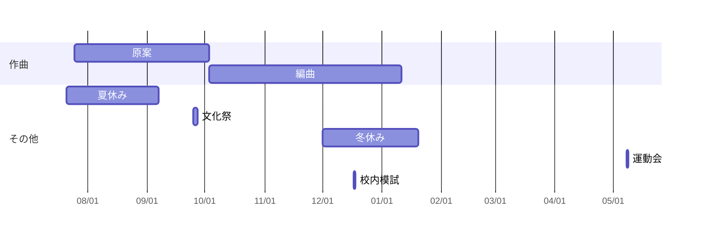

###### tags: `SportsDay` `Yell`
# エール係ハンドブック

*Created by 第77代赤組エール係*

[TOC]

これは[エール係ミーティング資料](https://hackmd.io/@kazuneko/rJtl8jS0O)よりも実践的なことを書いて行きます。
書き方は[Features](https://hackmd.io/features")を参考に〜

:::spoiler エール係ミーティング資料
<iframe width="100%" height="500" src="https://hackmd.io/@kazuneko/rJtl8jS0O" frameborder="0"></iframe>
:::

:::spoiler Features
<iframe width = "100%" height = "500"
src="https://hackmd.io/features"
frameborder="0"></iframe>
:::

### 予定

ごめん予定とかなんも覚えてない…間違えまくりですたぶん。
### 何がエールを構成するのか？
* 音関連
    * 音程
    * リズム
    * 強弱
    * 歌詞
    * エールCD
        * 録音されたエール
        * 伴奏付きのエール
        * アレンジ
        * CDのジャケット
* 音以外
    * 振り
    * アーチ
    * 当日の環境
        * 気温
        * 湿度
        * 風速、向
        * 観客の有無
* 意気込みとか気合い？

当日の環境は、そういう術を使える人はぜひお願いします。


## 作曲編
### 達成目標

- [ ] パッセージたくさん書いた
- [ ] メインのメロディー決まった
- [ ] 原曲書けた

### メロディーの作り方
https://youtu.be/ibSleg2qWyY によるとDAWで作る場合

>1. ドラムから作る
[color=red]
>2. コード進行から作る
>3. 音色からインスピレーションを得る
>4. 言葉を並べてメロディーを作る
>5. 聞いたことがない曲のイントロだけ聞く

ということらしいです。

#### コードから作る場合
カノン進行から作ろうとすると、どれとっても聞いたことあるようなメロディーにしかならなくない？

#### 旋法(モード)
https://ianring.com/musictheory/scales/
調べれば調べるほど沼で嫌になる…
* ドリアン旋法はD始まりのやつ

#### リズム
リズム注意して曲作るのもありからって思います  
~~所詮音程より印象に残る~~

:::spoiler ちーふのぼやき
こんなの使えたらかっこいいですね(これはデモンストレーションから持ってきました)

```abc
X:1
T:Speed the Plough
M:4/4
C:Trad.
K:G
|:GABc dedB|dedB dedB|c2ec B2dB|c2A2 A2BA|
GABc dedB|dedB dedB|c2ec B2dB|A2F2 G4:|
|:g2gf gdBd|g2f2 e2d2|c2ec B2dB|c2A2 A2df|
g2gf g2Bd|g2f2 e2d2|c2ec B2dB|A2F2 G4:|
```
:::

## 作詞編
### 達成目標

- [ ] 書きたいテーマは決まった
- [ ] 入れたいフレーズはもうある
- [ ] 歌詞書けた

分かんないから誰か書いて

## 歌唱編
### 達成目標

- [ ] 大声出る
- [ ] 低音部も高音部も余裕
- [ ] もう歌詞とか楽譜見なくても歌える

ここも正直分かんない